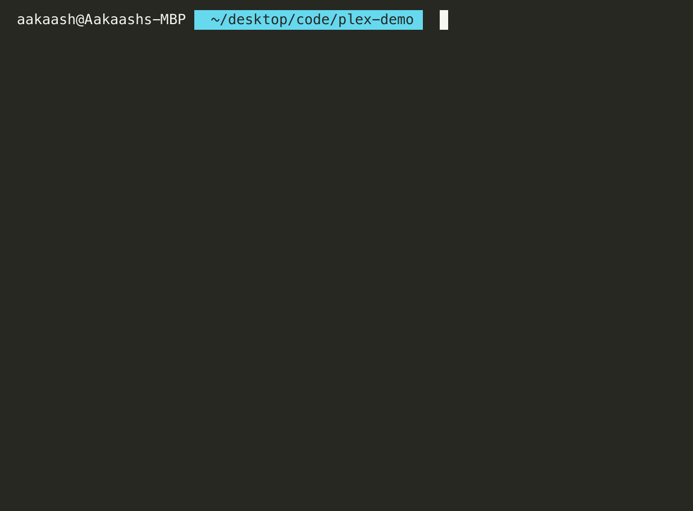

# PLEX 🧫×🧬→💊
⚡ **Build highly reproducible container workflows on top of a decentralised compute network.** ⚡

<p align="left">
    <a href="https://github.com/labdao/plex/blob/main/LICENSE.md" alt="License">
        
    </a>
    <a href="https://github.com/labdao/plex/releases/" alt="Release">
        
    </a>
    <a href="https://github.com/labdao/plex/pulse" alt="Activity">
        
    </a>
    <a href="https://img.shields.io/github/downloads/labdao/plex/total">
        
    </a>
    <a href="https://github.com/labdao/plex/actions/workflows/go.yml" alt="Tests">
        
    </a>
    <a href="https://twitter.com/intent/follow?screen_name=lab_dao">
        
    </a>
    <a href="https://discord.gg/labdao" alt="Discord">
        
    </a>
</p>


PLEX is a simple client for distributed computation.
* 🌎 **Build once, run anywhere at any scale:** PLEX is using distributed compute and storage to run containers on a public network. Need GPUs? We got you covered.  
* 🔗 **Strictly composable:** Every tool in PLEX has declared inputs and outputs. Plugging together tools by other authors should be easy.
* 🔍 **Content-addressed by default:** Every file processed by PLEX has a deterministic address based on its content. Keep track of your files and always share the right results with other scientists. 

PLEX is based on [Bacalhau](https://www.bacalhau.org/), [IPFS](https://ipfs.tech/), and inspired by [Pydantic](https://docs.pydantic.dev/) and the [Common Workflow Language](https://www.commonwl.org/user_guide/introduction/quick-start.html).

## 🚀 PLEX in one minute

1 . Install the client

Mac/Linux users open terminal and run
```
source <(curl -sSL https://raw.githubusercontent.com/labdao/plex/main/install.sh)
chmod +x ./plex
```

Windows users open terminal as an adminstrator and run
```
Invoke-Expression (Invoke-WebRequest -Uri "https://raw.githubusercontent.com/labdao/plex/main/install.ps1" -UseBasicParsing).Content
```

2. Claim a beta access token and follow the instructions to export to your terminal env
[Beta Access Form](https://try.labdao.xyz)

3. Submit an example PLEX job
```
./plex -tool tools/equibind.json -input-dir ./testdata/binding/abl
```



4. [Read the docs](https://docs.labdao.xyz/) to learn how to use PLEX with your own data and tools

## 💡 Use-Cases
* 🧬 run PLEX to [design proteins](https://docs.labdao.xyz/protein-folding/run-an-example) with colabfold and RFDiffusion
* 💊 run PLEX to run [small molecule docking](https://docs.labdao.xyz/small-molecule-binding/run-an-example) with equibind and diffdock
* 🐋 configure your containerised tool to run on PLEX

## 🧑‍💻 Developer Guide

### Building PLEX from source

```
git clone https://github.com/labdao/plex
cd plex
go build
```

### Running a compute node
This is a script for setting up a compute instance to run LabDAO jobs. Requires linux OS with Nvidia GPU.

Tested on Ubuntu 20.04 LTS with Nvidia T4, V100, and A10 GPUs (AWS G4, P3, and G5 instance types)

The install script sets up Docker, Nvidia Drivers, Nvidia Container Toolkit, and IPFS
```
curl -sL https://raw.githubusercontent.com/labdao/plex/main/scripts/provide-compute.sh | bash && newgrp docker
```

After the script run the following command in a separate terminal to start a Bacalhau server to accept jobs.
```
ipfs daemon
```

Once the daemon is running, configure the Bacalhau node based on the addresses used by the IFPS node.
```
ipfs id

# copy the ip4 tcp output and change port 4001 to 5001 then export
export IPFS_CONNECT=/ip4/127.0.0.1/tcp/5001/p2p/<your id goes here>

# example: export IPFS_CONNECT=/ip4/127.0.0.1/tcp/5001/p2p/12D3KooWPH1BpPfNXwkf778GMP2H5z7pwjKVQFnA5NS3DngU7pxG

LOG_LEVEL=debug bacalhau serve --job-selection-accept-networked --limit-total-gpu 1 --limit-total-memory 12gb --ipfs-connect $IPFS_CONNECT
```

To download large bacalhau results the below command may need ran 
```
sudo sysctl -w net.core.rmem_max=2500000
```

## 💁 Contributing 
PRs are welcome! Please consider our [Contribute Guidelines](https://docs.labdao.xyz/about-us/contributer_policy) when joining. 

From time to time, we also post ```help-wanted``` bounty issues - please consider our [Bounty Policy](https://docs.labdao.xyz/about-us/bounty_policy) when engaging with LabDAO.
