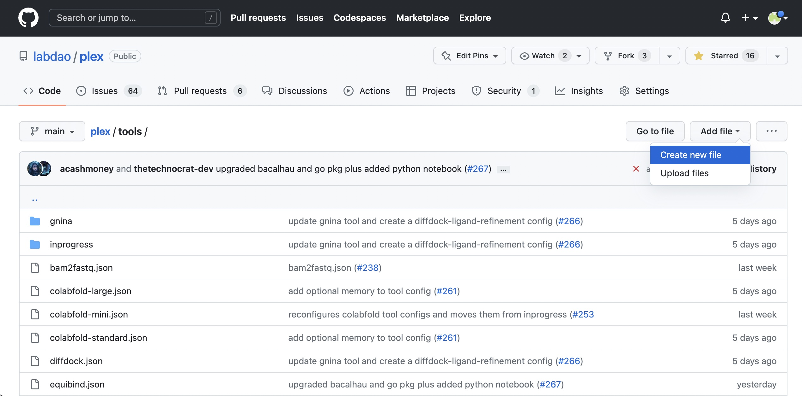
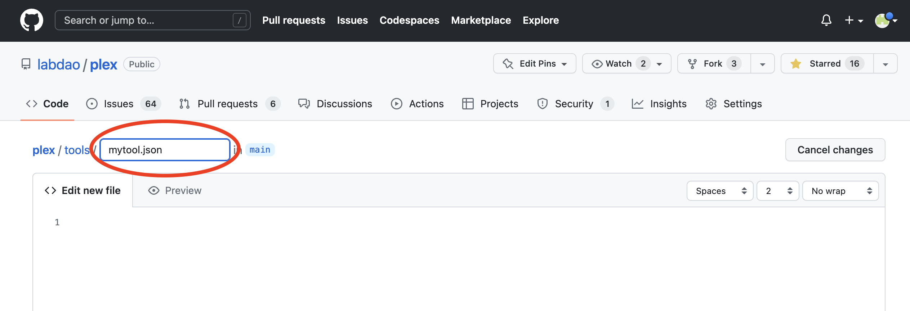
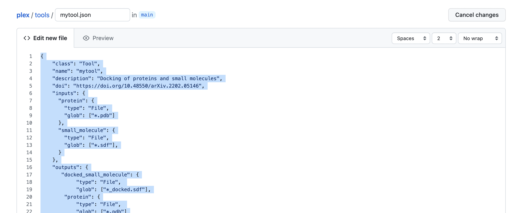
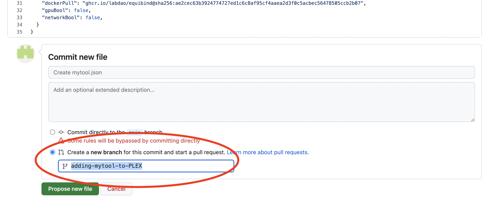
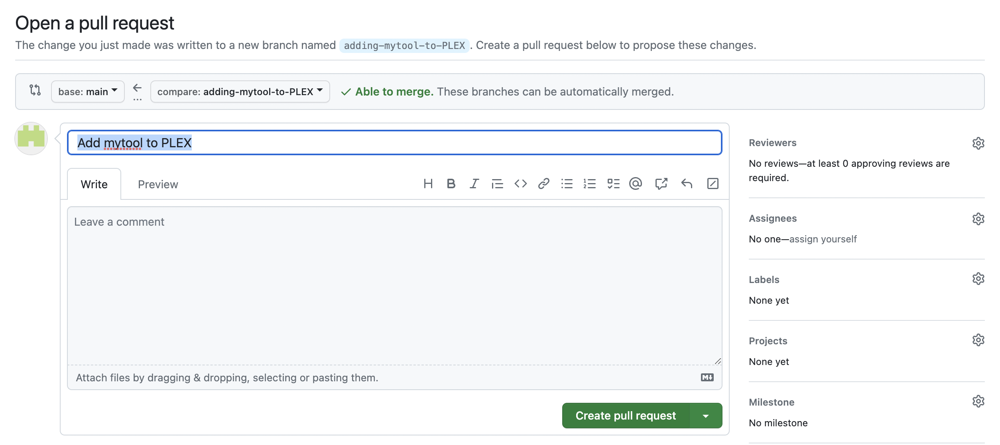

**We're on a mission to increase the number of tools available on PLEX, and we need your help.**

PLEX is an open source scientific project. Together, we can build state-of-the-art tooling for computational biology. PLEX is by scientists, for scientists.

Got a tool you'd like to see on PLEX? This tutorial will guide you through the steps required to contribute it to the ecosystem.

**Who is this for?**

Bioinformaticians, ML practitioners, developers and scientists who want to make it easier to run the latest computational biology tools.

**Why contribute a tool?**

By contributing a tool to PLEX, you’ll be part of an open-source community of scientists and engineers working to:

- Help make computational biology tooling more accessible and reliable
- Make individual tools more discoverable
- Support the creation of new scientific knowledge, by lowering the barriers to experimentation and invention

**Requirements:**

- Access to a Docker container of the tool you want to contribute (if you have the raw tool that you want to wrap in a container, [send us an email](mailto:stewards@labdao.com)).
- Comfortable with Docker and Docker files
- Experience using Conda
- Basic understanding of working with Pytorch and Cuda as dependencies
- RECOMMENDATION: Make sure you’ve managed to get the tool running from the command line on your own machine first, then do the PLEX config.
    - This familiarity will make it easier to structure the set-up on PLEX.
    - If you want to contribute a tool but don't have access to a GPU, please [send us an email](mailto:stewards@labdao.com) and we can help.

**Time required:**

About 1.5 hours of deep work. The first time you do it, it may take longer - but it gets easier the more you do!

Note: right now we only support Command Line Arguments to run tools. We are planning to add native python support soon.

---
# Step-by-step guide

## Step 0: Familiarise yourself with the tool configurations in PLEX

To make scientific tools easily accessible, we take inspiration from the Common Workflow Language (CWL) standard. 

:::note

**Why CWL?**

- CWL is a simple standard to define scientific workflows as chains of operations in YAML and JSON. No fancy domain-specific language.
- CWL is powering many genomics projects and sits at the core of a lot of other infrastructure in computational biology.
- The CWL standard is supported by a non-profit, the Software Freedom Conservancy ([https://sfconservancy.org/projects/current/](https://sfconservancy.org/projects/current/)), the same people that are supporting git and other projects.

:::

Below is an example tool config file for Equibind.

You will see that the config file contains:

1. Important information about the tool (e.g. its name and function)
2. Definitions of the inputs and outputs, include file types. 
3. The arguments required to run the tool
4. The docker container that encapsulates the tool
5. Whether the tool has additional requirements, such as a GPU and internet access

The rest of this guide takes you through the step-by-step process to create the config file and contribute a tool.

```
{
  "class": "Tool",
  "name": "equibind",
  "description": "Docking of small molecules to a protein",
  "doi": "https://doi.org/10.48550/arXiv.2202.05146",
  "baseCommand": ["/bin/bash", "-c"],
  "arguments": [
    "python main.py --protein $(inputs.protein.filepath) --small_molecule_library $(inputs.small_molecule.filepath);",
    "mv /outputs/ligands_predicted.sdf /outputs/$(inputs.protein.basename)_$(inputs.small_molecule.basename)_docked.$(inputs.small_molecule.ext);", 
    "cp /inputs/$(inputs.protein.filepath) /outputs/"
  ],
  "dockerPull": "ghcr.io/labdao/equibind@sha256:ae2cec63b3924774727ed1c6c8af95cf4aaea2d3f0c5acbec56478505ccb2b07",
  "gpuBool": false,
  "networkBool": false,
  "inputs": {
    "protein": {
      "type": "File",
      "glob": ["*.pdb"]
    },
    "small_molecule": {
      "type": "File",
      "glob": ["*.sdf"],
    }
  },
  "outputs": {
    "docked_small_molecule": {
      "type": "File",
      "glob": ["*_docked.sdf"],
    }
    "protein": {
      "type": "File",
      "glob": ["*.pdb"]
    }
  }
}
```

## Step 1: Gather important information about the tool

First, identify the tool you want to wrap. The key metadata you need are:

- The tool name (e.g. “equibind”) - please note that tool names should be **lowercase** and have **no spaces**.
- A short description of the tool’s function (e.g. “Docking of small molecules to a protein”).
- The DOI of the original manuscript, where the tool’s creators introduce the tool (e.g. [https://doi.org/10.48550/arXiv.2202.05146](https://doi.org/10.48550/arXiv.2202.05146)). We prefer links to non-paywalled manuscripts (i.e. an open access article, or a preprint).
- The link to the original Github repository for the tool (e.g. [https://github.com/HannesStark/EquiBind](https://github.com/HannesStark/EquiBind)).

Note: Open an issue in our github if you’re not sure about these details.

**Turning this into the config:**

Use this information for the first part of the config file. For example:

```
"class": "Tool",
"name": "equibind",
"description": "Docking of small molecules to a protein",
"doi": "https://doi.org/10.48550/arXiv.2202.05146",
```

The link to the Github repository is used to find information to fill out the rest of the config file.

## Step 2: Define inputs and outputs

**How does PLEX structure inputs and outputs?**

1. PLEX expects two directories for every tool an **/inputs** and an **/outputs** directory. 
2. Every tool added to PLEX **reads the files in the /inputs** directory and **shares the results in the /outputs** directory.
3. Most tools have specific input files and output files. For example:

| Tool      | What it does | Inputs | Outputs |
| ----------- | ----------- | ----------- | ----------- |
| Equibind | Predicts how a protein and small molecule will bind together | Protein structure (**.pdb**); Small molecule structure (**.sdf**) | Protein structure (**.pdb**); Small molecule pose (**.sdf**)   |
| Colabfold | Folds a protein sequence into a 3D structure | Protein sequence (**.fasta**) | 3D protein structure (**.pdb**) |

:::note

We are working to expand typing of biological file formats in the future with custom validators. If you want to contribute, please [send us an email](mailto:stewards@labdao.com).

:::

**For the tool you’re wrapping, you need to identify the particular inputs and outputs in a structured way.**

:::info

**Why the inputs/outputs structure matters**

The mission of PLEX is to make tools more accessible and reusable. At the moment, it can be hard to combine tools into chains of tools (for example: to take the output of Colabfold, and use it as the input of Equibind).

What we need are **standards** for tool configs, so that tools can be easily combined together. This is why, within PLEX, every tool needs “sticky ends” i.e. defined inputs and outputs that match. This allows others to combine tools into new chains for their projects, like lego blocks.

This property is often referred to as **composability.**

:::


# How to define inputs and outputs for the config file

1. **Understand what the config file looks for**
    
    In the config file, each input (and each output) will have a “type” and a “glob”:
    
    - type: We recommend `“type”: “File”` at present
    - glob: This is a pattern that PLEX will match to identify all the input files. It is usually the file ending and/ or a part of the file name that is constant and descriptive. You can see example globs in a table below.

    :::note
    Currently we require an **array of strings** for a single value as well as multiple values.
    ::: 
    
    For example, for Equibind, the inputs and outputs look like this:
    ```
    "inputs": {
      "protein": {
        "type": "File",
        "glob": ["*.pdb"]
      },
      "small_molecule": {
        "type": "File",
        "glob": ["*.sdf"],
      }
    },
    "outputs": {
      "docked_small_molecule": {
        "type": "File", 
        "glob": ["*_docked.sdf"],
      },
      "protein": {
        "type": "File", 
        "glob": ["*.pdb"]
      }
    },
    ```
2. **For a particular tool, find the inputs/outputs and their file types:** These should be found in the tool’s readme.
    
:::tip
Note that many tools create multiple outputs. You don’t need to specify every output the tool generates - just the files that you want other tools to be able to work with easily.
:::

3. **Decide which file formats to include:** Many tools will take several different file formats.
    - Where possible, for key inputs/outputs like protein sequences, **try to include the file formats specified in the table below.** Using the same file formats helps make the tools interoperable.
    - If you want to include multiple file formats for the same input or output, you can do this by passing an array of glob patterns. For example:
        
        ```
        "small_molecule": {
          "type": "File",
          "glob": ["*.sdf", "*.mol2"],
        },
        ```
        
    - When choosing file formats, consider the most simple activity of your tool:
        - For example, for Equibind, the most simple activity is to dock **one** small molecule against **one** protein. The inputs are therefore .sdf and .pdb. (A more complex use of Equibind is to dock 100 small molecules (as an array) against a protein. However, you don’t need to define the inputs as an array, because PLEX automatically handles the scaling of your tool for multiple inputs/outputs.)
4. **Record the input/output name, type, and glob and add to the config.** You can see example of these in the table of “common file formats for protein engineering” below.
5. **Repeat this for every input and output.** Make sure to check the syntax, especially curly brackets. Use the Equibind example to help.

Common file formats for protein engineering

| Input/output | Type | glob (preferred file format for PLEX) | Comment |
| --- | --- | --- | --- |
| Protein | “File” | ["*.pdb"] | 3D protein structure. |
| Small molecule | “File” | ["*.sdf"] *or* ["\*.sdf", "*.mol2"] | 3D small molecule structures. We generally recommend using .sdf files. |
| Small molecule SMILES | “File” | ["*.smi"] | SMILES (Simplified Molecular Input Line Entry Specification) describes the structure of molecules using short ASCII strings. |
| Peptide sequence (e.g. amino acid chains such as proteins) | “File” | ["*.fasta"] | Common format for sequencing data. |
| Nucleotide sequence (e.g. DNA, RNA) | “File” | ["*.fasta"] | As above. |
| Sequencing raw data | “File” | ["*.fastq"] | FASTQ is an extension of FASTA. It stores the biological sequence and the corresponding quality scores. Often this data comes from 2nd generation sequencing machines from Illumina. |
| Nanopore sequencing raw data | “File” | ["*.fast5"] | The standard sequencing output for Oxford Nanopore sequencers such as the MinION. Based on the HDF5 standard. Unlike .fasta and .fastq, .fast5 is binary. |

## Step 3: Specify arguments

The arguments are the code you would type into the terminal if you were running the tool when installed on your machine.

We will go through 3 examples to show how to specify arguments. First, let’s define some general best practices.

When defining arguments for PLEX keep the following in mind: 

- **PLEX expects two directories: an /inputs directory and an /outputs directory.** Note that these are the plural: inputs and outputs, **NOT** input and output.
- **File paths for input data have a specific format:** It uses the ```$(inputs)``` JSON notation. For example, the input protein file path is represented with ```$(inputs.protein.filepath)```.
- **We currently only support tools that are run from the command line**: Therefore, the “baseCommand” has to be ```["/bin/bash", "-c"]```.  Running python directly is coming soon.

:::info
Doing the arguments is probably the hardest part! If you're stuck, [send us an email](mailto:stewards@labdao.com) and we'll be happy to puzzle it out with you.
:::

**Overall argument structure**

The overall argument structure will usually be as follows:

Line 0: Prepare inputs [some tools only]

**Line 1: Inputs and outputs [required]**

Line 2: Embedding/weights [some tools only]

Line 3: Run inference command [some tools only]

Line 4. Move and/or rename results output folder using `mv` [*optional*]

:::tip

**Style tips**

- It’s usually easiest to use arguments in the same order as recommended in the documentation.
- Assess the formatting of the output filenames. If you think the filenames are not self explanatory, you can choose to rename them. For example:
    - Equibind [config file](https://github.com/labdao/plex/blob/main/tools/equibind.json): As standard, all docked poses are called “docked_ligand.sdf”. We have chosen to rename these to capture the name of the input protein and small molecule (e.g. 6d08_protein_processed_6d08_ligand_docked.sdf)
    - Diffdock [config file](https://github.com/labdao/plex/blob/main/tools/diffdock.json): The names are self-explanatory, so no renaming is required.

Get the tool running from your command line first. This is the easiest way to make sure the arguments work.

:::

# Worked examples for defining arguments

Below, we share sections from the original Github README for 2 tools, and then show what the PLEX arguments look like.

# Gnina

The Gnina [readme](https://github.com/gnina/gnina) contains the key arguments we need.

It says:

>
>To dock ligand `lig.sdf` to a binding site on `rec.pdb` defined by another ligand `orig.sdf`:
>
>`gnina -r rec.pdb -l lig.sdf --autobox_ligand orig.sdf -o docked.sdf.gz`
>
>To perform docking with flexible sidechain residues within 3.5 Angstroms of `orig.sdf` (generally not recommend unless prior knowledge indicates pocket is highly flexible):
>
>`gnina -r rec.pdb -l lig.sdf --autobox_ligand orig.sdf --flexdist_ligand orig.sdf --flexdist 3.5 -o flex_docked.sdf.gz`
>
>To perform whole protein docking:
>
>```
>gnina -r rec.pdb -l lig.sdf --autobox_ligand rec.pdb -o whole_docked.sdf.gz --exhaustiveness 64
>```

This becomes the below PLEX argument for whole protein docking:

```
"baseCommand": ["/bin/bash", "-c"],
"arguments": [
  "gnina -r $(inputs.protein.filepath) -l $(inputs.small_molecule.filepath) --exhaustiveness $(inputs.exhaustiveness) --autobox_ligand $(inputs.protein.filepath) --cnn_scoring $(inputs.cnn_scoring) -o /outputs/$(inputs.protein.basename)_$(inputs.small_molecule.basename)_docked_scored.sdf",
],
```

# Diffdock

The Diffdock [readme](https://github.com/gcorso/DiffDock) contains the information we need.

It says:


>For a single complex: specify the protein with, e.g., `--protein_path protein.pdb`
>and the ligand with `--ligand ligand.sdf`
>or `--ligand "COc(cc1)ccc1C#N"`
>
>We will soon also provide weights of a trained model without ESM2 embeddings such that this step is not necessary. Luckily, it is rather easy. First prepare a fasta for ESM2 (for a single protein use `--protein_path protein.pdb` instead):
>
>`python datasets/esm_embedding_preparation.py --protein_ligand_csv data/protein_ligand_example_csv.csv --out_file data/prepared_for_esm.fasta`
>
>Generate the embeddings with ESM2 (assuming that you are in the DiffDock directory):
>
>`git clone https://github.com/facebookresearch/esm
>cd esm
>pip install -e .
>cd ..
>HOME=esm/model_weights python esm/scripts/extract.py esm2_t33_650M_UR50D data/prepared_for_esm.fasta data/esm2_output --repr_layers 33 --include per_tok`
>
>And done, that is it!
>
>Run inference
>
>`python -m inference --protein_ligand_csv data/protein_ligand_example_csv.csv --out_dir results/user_predictions_small --inference_steps 15 >--samples_per_complex 10 --batch_size 10 --actual_steps 18 --no_final_step_noise`


Note that the standard baseCommand makes it clear that the arguments are generic bash commands.

To convert this into PLEX arguments, we look through the readme and see the different steps. We convert these into 4 lines of code that do the following:

1. The first line runs the ESM preparation on the input protein. The output here is the protein sequence that is now prepared for a tool called ESM, which is required to run Diffdock itself. 
2. The second line generates the ESM embeddings of the input protein.
3. The third line runs Diffdock itself. Note that we use the input parameters we defined in the previous step to configure where which argument goes.
4. The fourth line copies the input protein to the /outputs directory to make chaining tools easier in the future - this is not a required step and not mentioned in the readme above.

The PLEX arguments are therefore as follows:

```
"baseCommand": ["/bin/bash", "-c"],
"arguments": [
  "python datasets/esm_embedding_preparation.py --protein_path $(inputs.protein.filepath) --out_file /outputs/prepared_for_esm.fasta;",
  "HOME=esm/model_weights python esm/scripts/extract.py esm2_t33_650M_UR50D /outputs/prepared_for_esm.fasta /outputs/esm2_output --repr_layers $(inputs.repr_layers.default) --include per_tok && cp -r /outputs/esm2_output data/esm2_output;",
  "python -m inference --protein_path $(inputs.protein.filepath) --ligand $(inputs.small_molecule.filepath) --out_dir /outputs --inference_steps $(inputs.inference_steps.default) --samples_per_complex $(inputs.samples_per_complex.default) --batch_size $(inputs.batch_size.default) --actual_steps $(inputs.actual_steps.default) --no_final_step_noise;",
  "cp $(inputs.protein.filepath) /outputs"
]
```
If you're stuck, [send us an email](mailto:stewards@labdao.com) and we'll be happy to help puzzle it out with you.

## Step 4: Specify container

:::note

For this guide, we assume that you already have access to a containerized version of the tool. If you want to make your own container, we’ll be adding a guide soon. In the meantime, [send us an email](mailto:stewards@labdao.com).

:::

First, locate your container URL. We recommend containers stored on DockerHub.

Notable organizations with scientific applications on DockerHub include:

- STAPH-B: [https://hub.docker.com/u/staphb](https://hub.docker.com/u/staphb)
- Biocontainers: [https://hub.docker.com/u/biocontainers](https://hub.docker.com/u/biocontainers)
- Huggingface: [https://hub.docker.com/u/huggingface](https://hub.docker.com/u/huggingface) (especially for transformer models)

Notable scientists who actively contribute their tools as containers:

- The Satija Lab: [https://hub.docker.com/r/satijalab/seurat](https://hub.docker.com/r/satijalab/seurat)
- David Ryan Koes, PhD: [https://hub.docker.com/r/gnina/gnina](https://hub.docker.com/r/gnina/gnina)

Thank you for your important work!

The URL is found by looking at the container, and clicking “Digest" (example: [https://hub.docker.com/layers/gnina/gnina/latest/images/sha256-931809f6cc0ac3c43f9d09ddef0a7a03d0085e58a4aa50cf79c24fb708d58bae?context=explore](https://hub.docker.com/layers/gnina/gnina/latest/images/sha256-931809f6cc0ac3c43f9d09ddef0a7a03d0085e58a4aa50cf79c24fb708d58bae?context=explore)). 

The digest will look something like this:

`sha256:931809f6cc0ac3c43f9d09ddef0a7a03d0085e58a4aa50cf79c24fb708d58bae`

You can now construct the docker reference to follow the pattern ````author/tool@sha256:````
For example:

```
"dockerPull": "gnina/gnina@sha256:931809f6cc0ac3c43f9d09ddef0a7a03d0085e58a4aa50cf79c24fb708d58bae",
```

:::warning

We recommend to not use tags, such as ``latest`` when specifying a container image. Tags are not stable and a future version of the container you referenced might not run exactly the same way you (and others) expect.

:::


## Step 5: Define requirements

The final step before doing a pull request is to specify what requirements the tools has. PLEX only needs to understand two core requirements:

1. **Does your tool require GPU access?**
    
    This is shown with the config line: `“gpuBool:”` with options `true` or `false`
    
    Notes on GPU usage:
    
    - We generally recommend that you follow the authors’ guidance on whether to use GPUs or not.
    - While some tools (such as Diffdock) can be run on a CPU, they will be very slow. If a tool offers GPU as an option, when in doubt specify `true`.
    - If you are finding it difficult getting your tool to work on a GPU yourself, try running it on a CPU. If this works well, then specify `false`.
2. **Does your tool require access to the web (networking)?** I.e. to download files 
    
    This is shown with the config line: `“networkBool”:` with options `true` or `false`
    

When you have assessed these requirements, add them to the config.

Below is an example for Colabfold, which requires a GPU and web access to run queries against the MMSeq2 database:

```
"gpuBool": true,
"networkBool": true,
```

## Step 6: Submit your tool config to PLEX via a Pull Request

To submit your tool to PLEX, you will create a config file and submit it via a pull request. Here are the steps:

1. Go to [https://github.com/labdao/plex/tree/main/tools](https://github.com/labdao/plex/tree/main/tools)
2. Click “Add file”, then “Create new file”.

3. Create a json file for the config, by editing the filename. Name it after the tool (all lowercase, no spaces) e.g. "mytool.json".

4. Write the config code in the file body.

5. Carefully check the config code. If you are happy with it, scroll down and click “Create a new branch for this commit and start a pull request”. Give the branch a self-explanatory name e.g. “adding-mytool-to-PLEX”. Then, click “Propose new file”.

6. Open a pull request. Give the pull request a self-explanatory name such as “add mytool to PLEX”. Then, click “Create pull request”.

7. Wait for checks to complete. You’re done! We’ll now review the pull request and test it.
    

**Congratulations! You just added a tool to PLEX and helped make science more open, standardized and fast!** 

**How did you get on with this guide?** 

We’d love to hear from you. Drop us an email at [stewards@labdao.com](mailto:stewards@labdao.com).

In particular, let us know:

- Your comments on this guide, what you struggled with etc. We’re always ready to make it better.
- If you’re interested in contributing more than one tool to PLEX. If so, we should chat!
