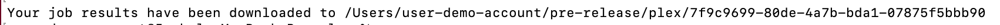
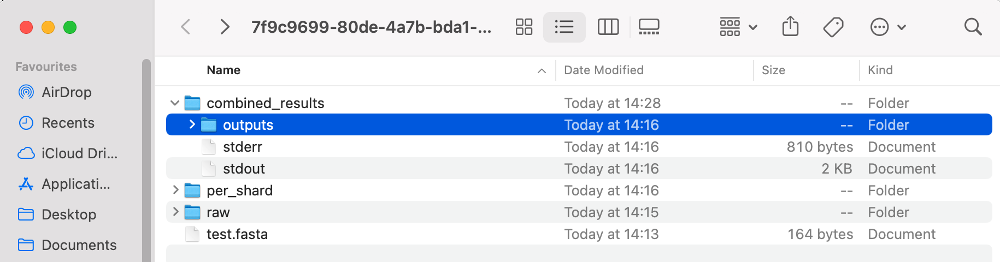
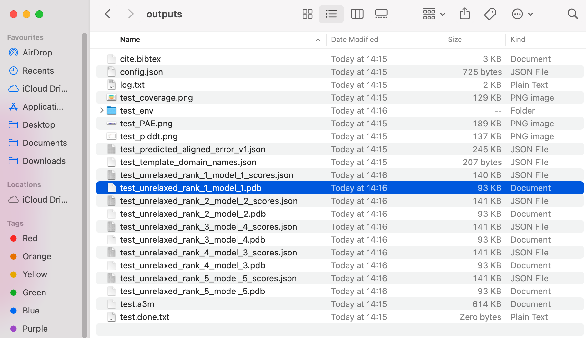
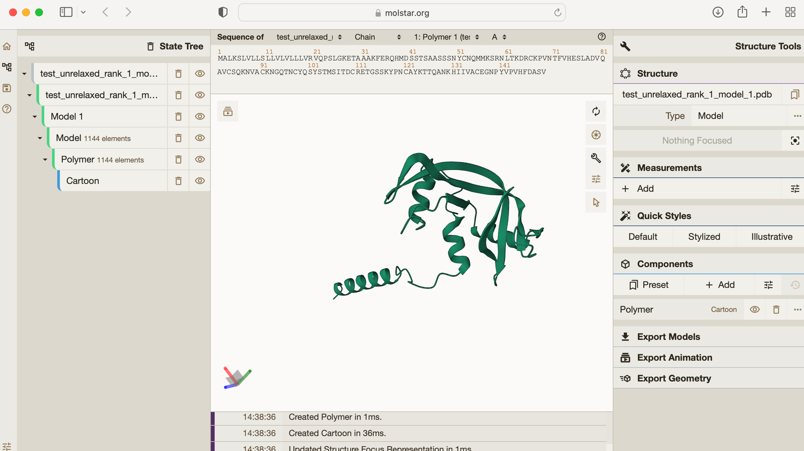

import AsciinemaPlayer from '../../src/components/AsciinemaPlayer.js';

This tutorial will guide you through the steps required to run a protein folding tool (Colabfold) directly from your computer.

By the end of this tutorial, you will have:

* Run a protein folding tool (Colabfold) on our provided test data, which included an amino acid string ready to be folded.
* Visualized the results

Let’s get started!

---

**Time needed:**
- 5 minutes

**Requirements:**

- Install PLEX ([installation guide here](../getting-started/install-plex.md))
- No previous technical experience - we’ll walk through each step.

---

After [installing PLEX](../getting-started/install-plex.md), follow the steps below:

### 1. Submit a job

Copy and paste the following command to run the tool using our provided test data and press **Enter**:

```
./plex -tool colabfold-mini -input-dir testdata/folding
```

You should see the following:

<div style={{ marginBottom: '20px' }}>
    <AsciinemaPlayer 
        src="/terminal-recordings/colabfold-mini.cast"
        rows={30}
        idleTimeLimit={3}
        preload={true}
        autoPlay={true}
        loop={false}
        speed={5}
    />
</div>

:::tip

You might get a pop-up asking *"Do you want the application “plex” to accept incoming network connections?”*. Click ***“Allow”***.

If you need to, you can turn off your firewall. To do this on your Mac, go to settings via `System Preferences > Security & Privacy`. Then go to the Firewall tab, and click the padlock icon at the bottom of the window to make changes. Click the “Turn off Firewall” button and try running the tool again.

:::

### 2. Get the results

Once the job is complete and the results have downloaded, you will see the file path where your results can be found. It will look something like this: 



To open the folder where your results are stored, type ```open ``` into your command line, followed by the file path you were given as an output e.g. ```open /Users/user-demo-account/plex/7f9c9699-80de-4a7b-bda1-07875f5bbb90```. Press **Enter**

This will show the job file contents.

Navigate to the "outputs" folder (within combined_results). In our example, the direct command would be ```open /Users/user-demo-account/pre-release/plex/7f9c9699-80de-4a7b-bda1-07875f5bbb90/combined_results/outputs```.



Colabfold gives a number of results (5 different protein structure options, ranked), and the bibtex file so you can cite it correctly:



### 3. Visualize the job results

To visualize the results, we are going to use Molstar.

In your results Finder window, identify the top ranked predicted structure: “test_unrelaxed_rank_1_model_1_scores.pdb".

To inspect this structure interactively with a viewer, open [the Molstar visualizer in your web browser.](https://molstar.org/viewer/)

Drag and drop the file “test_unrelaxed_rank_1_model_1_scores.pdb" into the central blank frame in Molstar to see the result:



You can see the predicted 3D structure for this amino acid sequence. If you want, you can explore the other predicted structures too e.g. "test_unrelaxed_rank_2_model_2.pdb/" by dragging and dropping this into Molstar too.

For more on how to use the Molstar viewer, check out [the Molstar documentation](https://molstar.org/viewer-docs/).

### Congratulations, you’ve downloaded PLEX and run a protein folding tool!