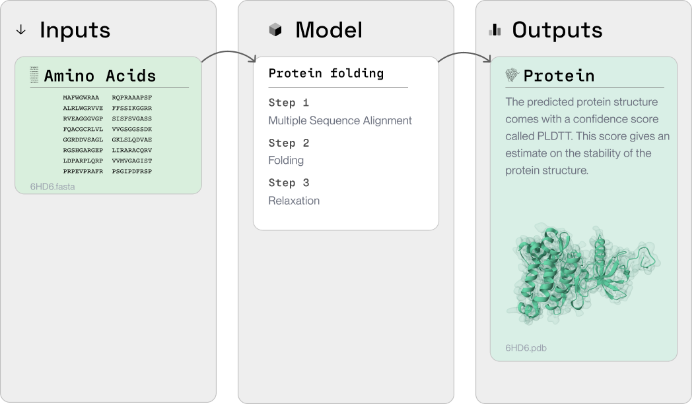

import OpenInColab from '../../src/components/OpenInColab.js';

<OpenInColab link="https://colab.research.google.com/drive/1AmxLoU5W2vYoi9KDw9IDoj3k4ijSCqoh?usp=sharing"></OpenInColab>

## Protein folding in silico

Protein folding is a crucial process in drug discovery. It helps research understand the 3D structure of experimental proteins and identify potential drug targets. With PLEX, predicting a protein's 3D structure from the amino acid sequence is streamlined and efficient.

In this tutorial, we'll walk through an example of how to use PLEX to predict a protein's 3D structure using [ColabFold](https://www.nature.com/articles/s41592-022-01488-1).



## Install PLEX


```python
!pip install PlexLabExchange
```

    Collecting PlexLabExchange
      Downloading PlexLabExchange-0.8.18-py3-none-manylinux2014_x86_64.whl (26.9 MB)
         ━━━━━━━━━━━━━━━━━━━━━━━━━━━━━━━━━━━━━━━━ 26.9/26.9 MB 20.1 MB/s eta 0:00:00
    [?25hInstalling collected packages: PlexLabExchange
    Successfully installed PlexLabExchange-0.8.18


Then, create a directory where we can save our project files.

```python
import os

cwd = os.getcwd()
!mkdir project

dir_path = f"{cwd}/project"
```

## Download protein sequence

We'll download a `.fasta` file containing the sequence of the protein we want to fold. Here, we're using the sequence of Streptavidin.


```python
!pip install requests

import requests

def download_file(url, directory, filename=None):
    local_filename = filename if filename else url.split('/')[-1]
    with requests.get(url, stream=True) as r:
        r.raise_for_status()
        with open(os.path.join(directory, local_filename), 'wb') as f:
            for chunk in r.iter_content(chunk_size=8192):
                f.write(chunk)
    return local_filename

url = 'https://rest.uniprot.org/uniprotkb/P22629.fasta' # Streptavidin

fasta_filepath = download_file(url, dir_path)
```

    Requirement already satisfied: requests in /usr/local/lib/python3.10/dist-packages (2.27.1)
    Requirement already satisfied: urllib3<1.27,>=1.21.1 in /usr/local/lib/python3.10/dist-packages (from requests) (1.26.16)
    Requirement already satisfied: certifi>=2017.4.17 in /usr/local/lib/python3.10/dist-packages (from requests) (2023.5.7)
    Requirement already satisfied: charset-normalizer~=2.0.0 in /usr/local/lib/python3.10/dist-packages (from requests) (2.0.12)
    Requirement already satisfied: idna<4,>=2.5 in /usr/local/lib/python3.10/dist-packages (from requests) (3.4)


## Fold the protein

With the sequence downloaded, we can now use ColabFold to fold the protein.

```python
from plex import CoreTools, plex_create

sequences = [fasta_filepath]

initial_io_cid = plex_create(CoreTools.COLABFOLD_MINI.value, dir_path)
```

    Plex version (v0.8.3) up to date.
    Temporary directory created: /tmp/2604ada3-04ec-4d58-9ecc-1e65134c15674117000244
    Reading tool config:  QmcRH74qfqDBJFku3mEDGxkAf6CSpaHTpdbe1pMkHnbcZD
    Creating IO entries from input directory:  /content/project
    Initialized IO file at:  /tmp/2604ada3-04ec-4d58-9ecc-1e65134c15674117000244/io.json
    Initial IO JSON file CID:  QmUhysTE4aLZNw2ePRMCxHWko868xmQoXnGP25fKM1aofb

This code initiates the folding process. We'll need to run it to complete the operation.

```python
from plex import plex_run

completed_io_cid, completed_io_filepath = plex_run(initial_io_cid, dir_path)
```

    Plex version (v0.8.3) up to date.
    Created working directory:  /content/project/03ef6ae4-b2ff-424b-894c-05f8fbe48888
    Initialized IO file at:  /content/project/03ef6ae4-b2ff-424b-894c-05f8fbe48888/io.json
    Processing IO Entries
    Starting to process IO entry 0 
    Job running...
    Bacalhau job id: ac42f8de-1fea-4e09-9644-75c940bdbd5c 
    
    Computing default go-libp2p Resource Manager limits based on:
        - 'Swarm.ResourceMgr.MaxMemory': "6.8 GB"
        - 'Swarm.ResourceMgr.MaxFileDescriptors': 524288
    
    Applying any user-supplied overrides on top.
    Run 'ipfs swarm limit all' to see the resulting limits.
    
    Success processing IO entry 0 
    Finished processing, results written to /content/project/03ef6ae4-b2ff-424b-894c-05f8fbe48888/io.json
    Completed IO JSON CID: QmdnjMsUar6nTqGwgjCwN1Fyjaan4i3zyht9SE9L235YRm
    2023/07/20 04:50:10 failed to sufficiently increase receive buffer size (was: 208 kiB, wanted: 2048 kiB, got: 416 kiB). See https://github.com/quic-go/quic-go/wiki/UDP-Receive-Buffer-Size for details.

After the job is complete, we can retrieve and view the results.


```python
import json

with open(completed_io_filepath, 'r') as f:
  data = json.load(f)
  pretty_data = json.dumps(data, indent=4, sort_keys=True)
  print(pretty_data)
```

    [
        {
            "errMsg": "",
            "inputs": {
                "sequence": {
                    "class": "File",
                    "filepath": "P22629.fasta",
                    "ipfs": "QmR3TRtG1EWszHJTpZWZut6VFqzBPWT5KYVJvaMdXFLWXn"
                }
            },
            "outputs": {
                "all_folded_proteins": {
                    "class": "Array",
                    "files": [
                        {
                            "class": "File",
                            "filepath": "P22629_unrelaxed_rank_1_model_1.pdb",
                            "ipfs": "QmXZHhB7qP1tnJNyR2TeH7m4gB1R5UF84SzvK94eYB9qdL"
                        },
                        {
                            "class": "File",
                            "filepath": "P22629_unrelaxed_rank_2_model_4.pdb",
                            "ipfs": "QmPWGR36mbm5qptniHxd5KjUQKVn8EFMc57DMJzwcetNnU"
                        },
                        {
                            "class": "File",
                            "filepath": "P22629_unrelaxed_rank_3_model_3.pdb",
                            "ipfs": "QmXQ1F8xD3TP1qDvU1HDhpuR5JDZvxv1G2udJSdTsimKvH"
                        },
                        {
                            "class": "File",
                            "filepath": "P22629_unrelaxed_rank_4_model_2.pdb",
                            "ipfs": "QmV4TZJyWbu4CcmLTvD6nKM8YpzDK4fBsiiA3KQkHjW1RG"
                        },
                        {
                            "class": "File",
                            "filepath": "P22629_unrelaxed_rank_5_model_5.pdb",
                            "ipfs": "QmVHT7nQzmNkxDJsRTJPAFqwqhqEgmD3QBGZpUPneogVqX"
                        }
                    ]
                },
                "best_folded_protein": {
                    "class": "File",
                    "filepath": "P22629_unrelaxed_rank_1_model_1.pdb",
                    "ipfs": "QmTxVHTSUr8kLa9W8yM7KUNth2pNn8m3x6M18x8yiaV2SU"
                }
            },
            "state": "completed",
            "tool": {
                "ipfs": "QmcRH74qfqDBJFku3mEDGxkAf6CSpaHTpdbe1pMkHnbcZD",
                "name": "colabfold-mini"
            }
        }
    ]

The output is a JSON file with information about the folded protein structures. This can be used for further analysis, visualization, and more.