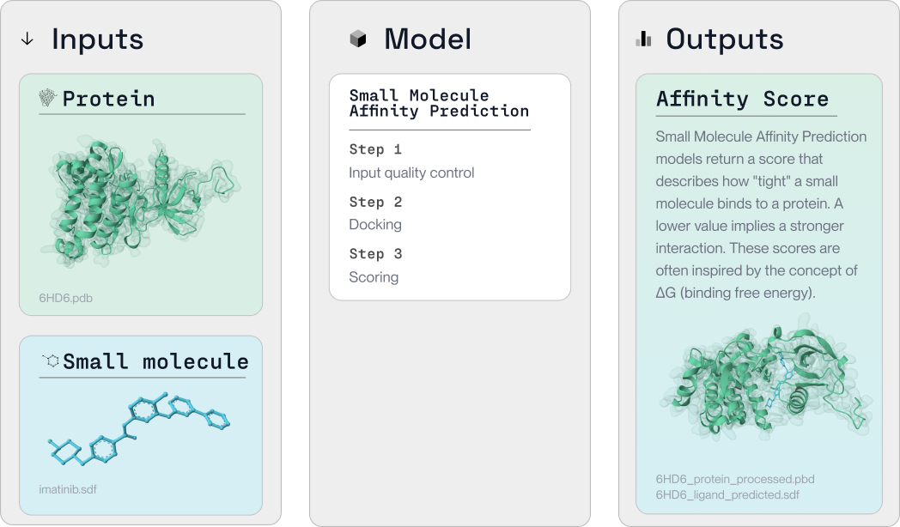

import OpenInColab from '../../src/components/OpenInColab.js';

<OpenInColab link="https://colab.research.google.com/drive/15nZrm5k9fMdAHfzpR1g_8TPIz9qgRoys?usp=sharing"></OpenInColab>

## Small molecule binding in silico

Small molecule binding is a fundamental aspect of drug discovery, facilitating the interaction of potential drugs with target proteins. With PLEX, this intricate process is simplified and made efficient. 

In the following tutorial, we illustrate how PLEX can be used to conduct small molecule binding studies to explore potential drug interactions with proteins. We demonstrate this with [Equibind](https://hannes-stark.com/assets/EquiBind.pdf).



## Install PLEX

We first install the plex pip package.


```python
!pip install PlexLabExchange
```

    Collecting PlexLabExchange
      Downloading PlexLabExchange-0.8.18-py3-none-manylinux2014_x86_64.whl (26.9 MB)
         ━━━━━━━━━━━━━━━━━━━━━━━━━━━━━━━━━━━━━━━━ 26.9/26.9 MB 19.2 MB/s eta 0:00:00
    [?25hInstalling collected packages: PlexLabExchange
    Successfully installed PlexLabExchange-0.8.18


## Load small molecule and protein data

Next, we need to load the data about the small molecule and the protein that we're studying. This data, which is available on IPFS, will be used to initialize an IO JSON. This JSON file will serve as the job instructions for our binding study.

```python
small_molecule_path = ["QmV6qVzdQLNM6SyEDB3rJ5R5BYJsQwQTn1fjmPzvCCkCYz/ZINC000003986735.sdf"]
protein_path = ["QmUWCBTqbRaKkPXQ3M14NkUuM4TEwfhVfrqLNoBB7syyyd/7n9g.pdb"]
```


```python
from plex import CoreTools, plex_init

initial_io_cid = plex_init(
    CoreTools.EQUIBIND.value,
    protein=protein_path,
    small_molecule=small_molecule_path
)
```

    plex init -t QmZ2HarAgwZGjc3LBx9mWNwAQkPWiHMignqKup1ckp8NhB -i {"protein": ["QmUWCBTqbRaKkPXQ3M14NkUuM4TEwfhVfrqLNoBB7syyyd/7n9g.pdb"], "small_molecule": ["QmV6qVzdQLNM6SyEDB3rJ5R5BYJsQwQTn1fjmPzvCCkCYz/ZINC000003986735.sdf"]} --scatteringMethod=dotProduct
    Plex version (v0.8.3) up to date.
    Pinned IO JSON CID: QmShD7ApeDBUqqy98RuuKdyv8AdmBsvyZqqxSLAEvB9EKP


## Dock the small molecule and protein using Equibind

Now that we've prepared our job instructions, we're ready to dock the small molecule and protein using Equibind. With the IO JSON created and pinned to IPFS, we submit the job to the LabDAO Bacalhau cluster for computation.

```python
from plex import plex_run

completed_io_cid, io_local_filepath = plex_run(initial_io_cid)
```

    Plex version (v0.8.3) up to date.
    Created working directory:  /jobs/3f9b386d-a74d-463c-8ca6-a882d053c866
    Initialized IO file at:  /jobs/3f9b386d-a74d-463c-8ca6-a882d053c866/io.json
    Processing IO Entries
    Starting to process IO entry 0 
    Job running...
    Bacalhau job id: a292c5fc-a717-47d5-a5b4-4d3401670a4f 
    
    Computing default go-libp2p Resource Manager limits based on:
        - 'Swarm.ResourceMgr.MaxMemory': "6.8 GB"
        - 'Swarm.ResourceMgr.MaxFileDescriptors': 524288
    
    Applying any user-supplied overrides on top.
    Run 'ipfs swarm limit all' to see the resulting limits.
    
    Success processing IO entry 0 
    Finished processing, results written to /jobs/3f9b386d-a74d-463c-8ca6-a882d053c866/io.json
    Completed IO JSON CID: QmVG4mT2kkPSb6wzT5QxYZndB5VbKLU8nH2dErZW2zxae6


## Viewing the results

The final step is to view our results. We read in the IO JSON file that contains the output from our job and print it. This data includes the best docked small molecule and the protein used, each with their own IPFS CIDs.


```python
import json

with open(io_local_filepath, 'r') as f:
  data = json.load(f)
  pretty_data = json.dumps(data, indent=4, sort_keys=True)
  print(pretty_data)
```

    [
        {
            "errMsg": "",
            "inputs": {
                "protein": {
                    "class": "File",
                    "filepath": "7n9g.pdb",
                    "ipfs": "QmUWCBTqbRaKkPXQ3M14NkUuM4TEwfhVfrqLNoBB7syyyd"
                },
                "small_molecule": {
                    "class": "File",
                    "filepath": "ZINC000003986735.sdf",
                    "ipfs": "QmV6qVzdQLNM6SyEDB3rJ5R5BYJsQwQTn1fjmPzvCCkCYz"
                }
            },
            "outputs": {
                "best_docked_small_molecule": {
                    "class": "File",
                    "filepath": "7n9g_ZINC000003986735_docked.sdf",
                    "ipfs": "QmZdoaKEGtESnLoHFMb9bvqdwXjyUuRK6DbEoYz8PYpZ8W"
                },
                "protein": {
                    "class": "File",
                    "filepath": "7n9g.pdb",
                    "ipfs": "QmUWCBTqbRaKkPXQ3M14NkUuM4TEwfhVfrqLNoBB7syyyd"
                }
            },
            "state": "completed",
            "tool": {
                "ipfs": "QmZ2HarAgwZGjc3LBx9mWNwAQkPWiHMignqKup1ckp8NhB",
                "name": "equibind"
            }
        }
    ]

This output provides us with key information about the small molecule-protein interaction. The "best_docked_small_molecule" represents the most likely interaction between the protein and the small molecule, which can inform subsequent analysis and experiments.

<OpenInColab link="https://colab.research.google.com/drive/15nZrm5k9fMdAHfzpR1g_8TPIz9qgRoys?usp=sharing"></OpenInColab>
