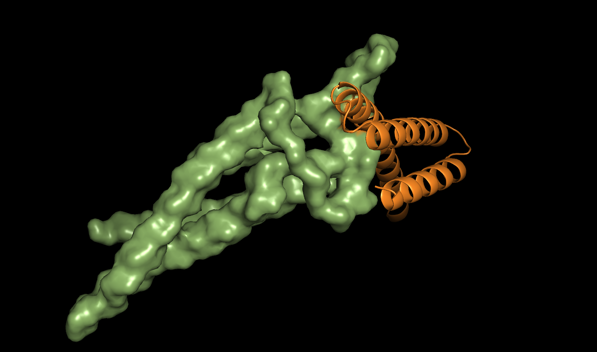

# Using RFDiffusion to design novel CD20 binders

## Introduction
The CD20 protein is a canonical B-cell surface marker. It is the target for popular immuno-suppresive therapeutics such as Rituximab and has recently also been explored for [CAR-T therapy](https://ascopubs.org/doi/abs/10.1200/JCO.2021.39.15_suppl.2508) options after anti-CD19 treatment failure in B-cell lymphomas and leukemias. 

In this micropublication we demonstrate the use of RFDiffusion to generate potential protein binders against CD20. 

## Materials and Methods
### CD20 Target structure
Target structures for CD20 were sourced from the [PDB](https://www.ebi.ac.uk/pdbe/pdbe-kb/proteins/P11836) and [Alphafold](https://alphafold.ebi.ac.uk/entry/P11836) database.

### RFDiffusion implementation
RFDiffusion was made accessible in a [public docker image](public.ecr.aws/p7l9w5o7/rfdiffusion:latest@sha256:0a6ff53004958ee5e770b0b25cd7f270eaf9fc285f6e91f17ad4024d2cc4ea91) and run on the PLEX compute platform. [PLEX](docs.labdao.xyz) is a peer-to-peer compute framework built on top of CWL, Bacalhau, and IPFS. The tool configuration file for this micropublication is shared below.

## Results
Previous studies identified the CD20 protein to be expressed on the cell surface as a homodimer in a compact barrel-structure. The CD20 residues interacting with Rituximab include residues 170ANPSE174 of the extracellular loop 2 as well as residue 76 and 161. 

Based on this prior knowledge we parameterised the binder generation with RFDiffusion to include hotspots for the previously identified residues. 

```
"'ppi.hotspot_res=[D170, D171, D172, D173, D174, D76, D161]'"
````

We next generated a set of 10 proposed binders using the PLEX command line interface. To speed up the binder generation, we only used a CD20 monomer as template.

```
# creating the computational graph by specifying the tool config and input data directory 
./plex create -t tools/rfdiffusion/rfdiffusion_hotspot.json -i tools/rfdiffusion
# resulting graph id: QmW5inFtxkiP6HjqXyZNurWAGpNixc71jexPn5p8DpgmP
# submitting the computational graph to the network
./plex run -i QmW5inFtxkiP6HjqXyZNurWAGpNixc71jexPn5p8DpgmP
````

As expected, the generated candidate structures were bound to the extracellular domains of the CD20 protein. As previously described by the RFDiffusion authors, the generated constructs showed a strong preference for helical designs.



The complete set of binders, including the tool configuration and input data can be retrieved from ipfs://QmXfZTq7WZVitbTvuQFLDn75n7dH1yb8YK9WZ6xYi89hXp.

## Discussion
In this micrpublication we show how RFDiffusion can be used on PLEX to generate protein binder candidates. 

To create candidate binders with a high likelihood of binding to CD20 in-vivo, the target structure should be extended to comprise the CD20 homodimer. 

## References

1. Rougé, L. et al. Structure of CD20 in complex with the therapeutic monoclonal antibody rituximab. Science 367, 1224–1230 (2020).

2. Liang, A. et al. Safety and efficacy of a novel anti-CD20 chimeric antigen receptor (CAR)-T cell therapy in relapsed/refractory (r/r) B-cell non-Hodgkin lymphoma (B-NHL) patients after failing CD19 CAR-T therapy. JCO 39, 2508–2508 (2021).

3. Watson, J. L. et al. Broadly applicable and accurate protein design by integrating structure prediction networks and diffusion generative models. http://biorxiv.org/lookup/doi/10.1101/2022.12.09.519842 (2022) doi:10.1101/2022.12.09.519842.


